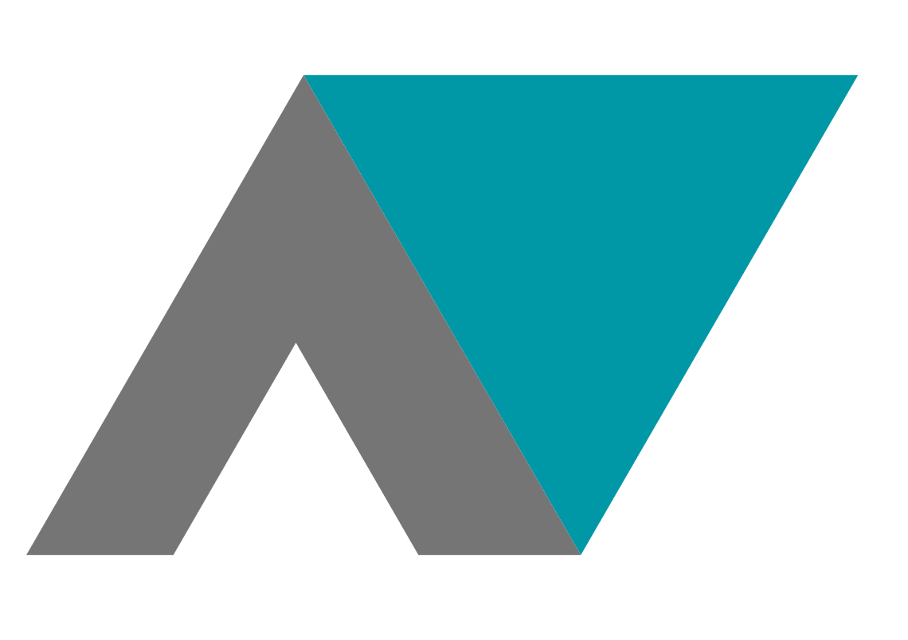

<p align="center">
  
</p>
<h1 align="center">AppVenture</h1>

## Compete to be the best.

>AppVenture is a website for competition lovers. Here you can 
search for tournaments or sports and fight for trophies versus other people.

[Test our website!](https://appventure-web.firebaseapp.com/) :metal:

## Build Setup

``` bash
# install dependencies
$ npm install

# serve with hot reload at localhost:3000
$ npm run dev

# build for production and launch server
$ npm run build
$ npm start

# generate static project
$ npm run generate
```

For detailed explanation on how things work, checkout the [Nuxt.js docs](https://nuxtjs.org/).

## Licensing

AppVenture is licensed under the Apache License, Version 2.0. See [LICENSE](LICENSE) for the full license text.
